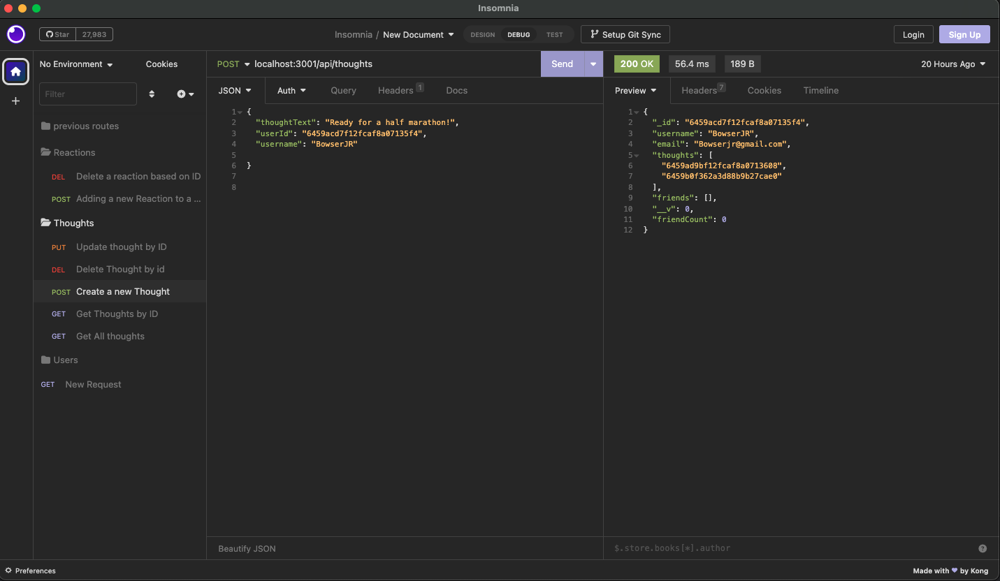

<h1 align="center">🥭MongoConnectFriends 👨‍👨‍👦‍👦 </h1>

    
    
    
    
    

  

    
    
    
    
    
    

#
## Description
🥭MongoConnectFriends 👨‍👨‍👦‍👦 is a social media REST API built with MongoDB, ExpressJS and the Mongoose Node package.  It allows users to create thoughts, react to other users' thoughts as well as adding and removing friends. 

# 
## Installation and Getting Started
1. Install MongoDB locally on your machine (please follow the instructions on the [MongoDB Website](https://docs.mongodb.com/manual/installation/)) for detailed installation steps
2. Clone the repository
3. Install dependencies with `npm -i`
4. Run `npm start` to run the server and make the API live
5. Use your browser or [Insomnia](https://insomnia.rest/) to test the REST API endpoints.
6. See this additional [walkthrough video](https://www.youtube.com/watch?v=vWfqeJHBMeY&feature=youtu.be) for clarifications and a live demonstration
#
## Models
- User
- Thought
- Reaction (used as a subdocument in Thought)

## Endpoints
**User** 👥
- Get all users:        `GET /api/users`
- Create a user:        `POST /api/users`
- Get user by ID:       `GET /api/users/:id`
- Update a user:        `PUT /api/users/:id`
- Delete a user:        `DELETE /api/users/:id`
- Add a friend:         `PUT /api/users/:userId/friends/:friendId`
- Delete a friend:      `DELETE /api/users/:userId/friends/:friendId`

**Thought** 💭
- Get all thoughts:     `GET /api/thoughts`
- Create a thought:     `POST /api/thoughts`
- Get thought by ID:    `GET /api/thoughts/:id`
- Update a thought:     `PUT /api/thoughts/:id`
- Delete a thought:     `DELETE /api/thoughts/:id`

**Reaction**🔥
- Add a reaction:       `PUT /api/thoughts/:id/reactions`
- Delete a reaction:    `DELETE /api/thoughts/:id/reactions`

## Packages
- [expressJS](https://expressjs.com/)
- [momentJS](https://www.npmjs.com/package/moment)
- [mongoose](https://www.npmjs.com/package/mongoose)

## Questions
If you have questions, email me at [lingeorge04@gmail.com](mailto:lingeorge04@gmail.com) or reach out on [GitHub](https://www.github.com/lingeorge88).